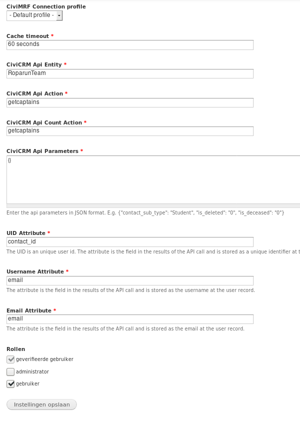

# CiviMRF User Sync module

This module syncs contacts from civicrm to user records in a Drupal website.
The civicrm does not need to be installed in this drupal website. 

## Requirements

* cmrf_core: https://github.com/CiviMRF/cmrf_core

## Installation

1. Install cmrf_core (https://github.com/CiviMRF/cmrf_core)
2. Configure cmrf_core
3. Install this module
4. Configure the module at admin/config/civimrf/civimrf_user_sync
5. Dont forget to setup a cron job for your drupal site

## Configuration

Below is a screen shot of the configuration screen:



You can configure which api you want to use for syncing contacts to users. In the screenshot you see we have a custom api
You can also configure which field from the api goes to the drupal username, email, uid field.

The uid field is defined by this module and is used to store the contact id (or another unique identifer).

## How does the sync work?

Each time the cron runs the _user sync_ will determine how many contacts from civicrm need to be synced to Drupal.
A batch is created which synchronizes 100 contacts. 
After all contacts are synchronized contacts who are in the system but not in the synchronisation are deleted.

When a new user record is created a user receives the email to reset his/her password. If you want you can change the text of this email. 
You can do this under Configuration --> Account Settings --> Welcome (new user created by administrator)

When an existing user is deleted the user receives an email stating his/her account has been cancelled. If you want you can change the text of this email. 
You can do this under Configuration --> Account Settings --> Account cancelletion confirmation

## Hooks provided by this module (for developers only)

This module provides the following hooks

* `hook_civimrf_user_update_alter`
* `hook_civimrf_user_new_alter`

Below an example implemntation of those hooks. In this example the api used returns the team_id (which is the contact id of the team record in CiviCRM). We want to store this team_id on the user record in Drupal.

```php

function roparun_team_portal_civimrf_user_update_alter(&$edit, $contact) {
	if (isset($contact['team_id'])) {
		$edit['roparun_team_portal_team_id']['und'][0]['value'] = $contact['team_id'];
	}
}

function roparun_team_portal_civimrf_user_new_alter(&$edit, $contact) {
	if (isset($contact['team_id'])) {
		$edit['roparun_team_portal_team_id']['und'][0]['value'] = $contact['team_id'];
	}
}

```
